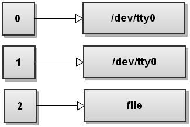

# Bash
### Group commands without subshell with '\{\}'
Following command does not do the result one might expect. Regardless of the exit
status of the `cd /tmp`, `exit` command will always be run.
```bash
cd /tmp || echo "cd to /tmp failed"; exit
# Exits anyways even if cd was succesful
```

```admonish note
In `bash` you may treat `;` as an equilent of a newline.
```

```admonish note
Use `{ cmds }` to group a list of commands that will be executed in the current
shell. At the other hand, `( cmds )` will execute the `cmds` in a subshell.
```

#### Don't forget the `;`

```bash
$ bash
$ cd /tmp || { echo "cd to /tmp failed"; exit }
>
>
>
> ^C
$
```
~~~admonish warning
When using command grouping with curly braces '{', always end the list of
commands inside the curly braces with a semicolon and a space ';\<space\>' like
this:

```bash
$ cd /tmp || { echo "cd to /tmp failed"; exit; }
```
~~~

~~~admonish success
```bash
$ cd /tmp || { echo "cd to /tmp failed"; exit; }
$
```
~~~

References
- Bash idioms, 2022
---
### Output redirection
When bash starts it opens three file descriptors:  
1. stdin -> File descriptor(fd) 0  
1. stdout -> fd 1  
1. stderr -> fd 2  

Assuming your terminal is `/dev/tty0`, here is how the file descriptor table
looks like when bash starts:  


You can also open, close and copy file descriptors. And you can also write to
them and read from them.

#### Redirect the standard output of a command to a file
```bash
command >file
```
Operator `>` is the output redirection operator. Bash first tries to open the
file for writing and if it succeeds it sends the stdout of command to the newly
opened file. If it fails opening the file, the whole command fails.  

~~~admonish note
Writing `command >file` is the same as writing `command 1>file`.  
~~~

When you write the command above, bash opens the `file` and and replaces the fd
1 with the fd that points to the file. The result is that all the standard
output gets redirected, or in anoter words, ends up being written to `file`   


~~~admonish example
Redirects text "test_text" to a file:
```bash
echo test_text > /tmp/file
```
~~~

#### Redirect the standard error of a command to a file
```bash
command 2> file
```
Here bash redirects stderr to file:  
  
Bash opens `file` for writing, replaces fd 2 with th fd of `file`.
Effectively, anything written to the stderr gets redirected to the `file`.

#### Redirect both standard output and standard error to a file
```bash
command &>file
```

`&>` operator redirects both stdout and sterr of the `command` to `file`.
This is bash's shortcut for quickly redirecting both streams to the same
destination.  
Here is how the file descriptor table looks like after bash has redirected both
streams:  


~~~admonish example
Here we're trying to check if we've installed `trash-cli` package. And set
variable if so.  
If we don't have the binary `trash`, it will give `command not found`
error:
```bash
$ trash -h && export NNN_TRASH=1

bash: trash: command not found
```
We can redirect stderr and stdout like this:
```bash
$ trash -h &>/dev/null && export NNN_TRASH=1
$
```
or
```bash
$ trash -h>/dev/null 2&>1 && export NNN_TRASH=1
$
```
~~~

<p style="font-size:1.3em">Another way to redirect both streams to the same destination:</p>  

```bash
command >file 2>&1
# Same as command 1>file 2>&1
```
First, bash opens the file `file` for writing. And then reassigns file
descriptor 1 to point to that file. Effectively command `command`'s
stdout(remember that stdout's fd is 1) gets written to `file`.  

We didn't see the `>&` syntax, that is [file descriptor
duplication](https://www.gnu.org/software/bash/manual/html_node/Redirections.html#Duplicating-File-Descriptors).  

~~~admonish quote
```c
int dup2(int fd1, int fd2);
```
Returns a file descriptor with the value fd2. fd2 now refers to the same file
as fd1, and the file that was previously referred to by fd2 is closed.  

...

If successful, dup2() returns fd2.

\- [https://www.ibm.com/docs/en/zos/3.1.0?topic=functions-dup2-duplicate-open-file-descriptor-another](https://www.ibm.com/docs/en/zos/3.1.0?topic=functions-dup2-duplicate-open-file-descriptor-another)
~~~

Under the hood `2>&1` redirection operation calls `dup2()` two times:
```bash
$ strace --follow-forks bash -c 'ls >file 2>&1' 2>&1 | rg dup2

[pid 70318] dup2(3, 1)                  = 1
[pid 70318] dup2(1, 2)                  = 2
```

<!--  -->

System call `dup2(3,1)` was made. File descriptor 1 duplicated onto the 3. I
like think this as "move fd 1 to the whatever file that fd 3 points to". Since
fd 3 points to the `file`, stdout(file descriptor 1) is now redirected to the `file`(fd 3).

.png)

After second syscall `dup2(1, 2)` fd table looks like this:  
.png)  
Fd 2 now points to the file that fd1 points, which is `file`.

~~~admonish tip
<p style="font-size:1.3em">A mental model</p>
It is important to know how `command >file 2>&1` works but you can think like
this for remembering easily:  

- `>file` is a shortcut to the `1>file`  
- `n>file` redirects output of the file desriptor with the number `n` to the file `file`  
- If you want to redirect output of a file descriptor to the another file descriptor, use `n>&m`  
~~~


References
- https://catonmat.net/bash-one-liners-explained-part-three
- https://pubs.opengroup.org/onlinepubs/9799919799/utilities/V3_chap02.html#tag_19_07
- https://www.gnu.org/software/bash/manual/html_node/Redirections.html
---
